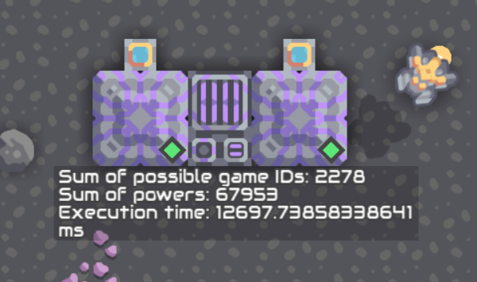

# Day 2

## Instructions for running

1. Run `compile.sh` on a Linux (sub-)system. Flex must be installed.
2. Start [Mindustry](https://github.com/Anuken/Mindustry), load a map, place two hyper processors (A and B) and connect them to a cryofluid source.
3. Place a switch, a memory bank and a message block and connect them to both processors.
4. Paste first `input0.mlog` into processor A and then `program.mlog` into processor B.
5. Wait until the message block displays "Insert disk 2", then copy `input1.mlog` into processor A.
6. Read the result from the message block once it appears.

A single Mindustry Logic file cannot have more than 1000 instructions.
However, a little less than 2000 instructions are needed to load all values into the memory bank.
That is why I had the compiler split the input into two files, each with a little less than 1000 instructions.
Processor B will halt until the second input file is loaded, because it waits for processsor A to deactivate the switch, which it does when the file is loaded.

## Instructions for running an example

If the input has less than 50 lines, it cannot be processed by `compile.sh`. Use `compile-example.sh` instead.

1. Run `compile-example.sh` on a Linux (sub-)system. Flex must be installed.
2. Start [Mindustry](https://github.com/Anuken/Mindustry), load a map, place two hyper processors (A and B) and connect them to a cryofluid source.
3. Place a switch, a memory bank and a message block and connect them to both processors.
4. Paste first `input.mlog` into processor A and then `program.mlog` into processor B.
5. Read the result from the message block once it appears.
