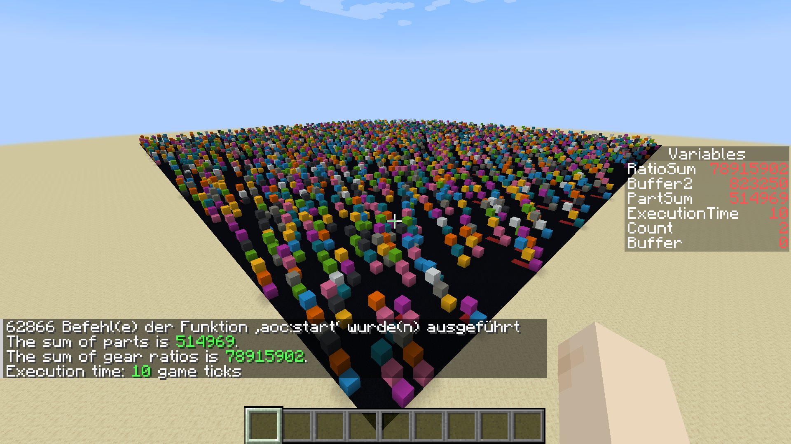

# Day 3

## Instructions for running

1. Run `compile.sh` on a Linux (sub-)system. Flex and build-essential must be installed. This step is only needed if you replace the data in `input.txt`.
2. Start Minecraft Java Edition 1.20.2 and create a new superflat world. In the world creation menu, import the data pack `aoc23_03_pack` and activate it. Commands must be enabled.
3. Set your render and simulation distance to a reasonable level. I am running a fresh installation of Minecraft, so the default values should work.
4. Optional: Run the command `/gamerule commandBlockOutput false` if you do not want every armor stand to announce how many commands it executed. 
5. While standing on the ground (and not *under* any blocks within 200 meters south and east), run the command `/function aoc:start`.
6. Wait until a message appears in the chat announcing the result.

Minecraft has a command limit of 65536 commands in a single tick.
For my input, it runs 62866 commands in the first tick.
Since this is already very close to that limit, it might not work for all input data.
If the chat displays "Executed 65536 command(s) from function 'aoc:start'" and the result does not appear, then this is what is happening.
You can try changing it to something higher, e.g. with the command `/gamerule maxCommandChainLength 100000`.

